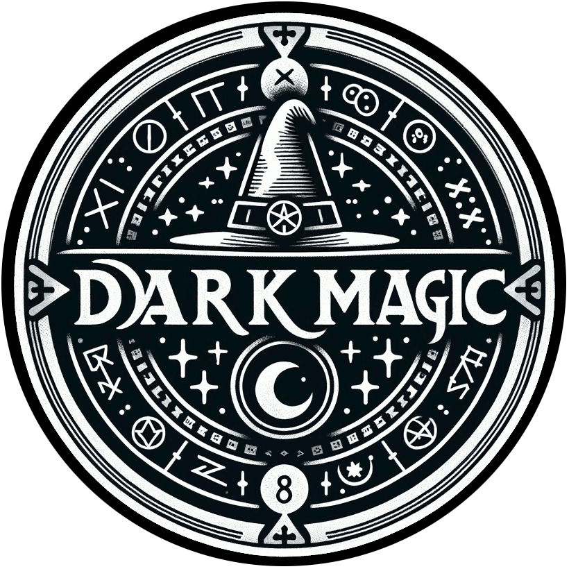

<h1 align="center">Dark Magic</h1>
<h3 align="center">An Open-Source Diablo 2 Engine Rewrite</h3>

  

### About

Dark Magic is a community-driven open-source project that aims to recreate the 
legendary Diablo 2 gaming experience from scratch. Our mission is to modernize 
and enhance the game engine while preserving the classic gameplay mechanics and 
nostalgia that made Diablo 2 a timeless masterpiece.

Inspired by the passion of the Diablo community, we strive to deliver an 
authentic and faithful journey into the dark and dangerous world of Sanctuary. 
Together, we can bring back the magic of this iconic game and shape its future.

## Directory Structure
* `cmd` - contains a directory for each binary that can be compiled. some of what is here may be migrated to a `tools` directory in the future. 
* `pkg/models` - contains all the d2 models, much of them being the structs which represent records loaded from the MPQ excel files.
* `pkg/services` - contains all the high-level application services like file loaders, lua environment, config file manager, etc.

## Services
This project uses the [Runtime](https://github.com/gravestench/runtime) framework, 
which necessitates the high-level organization of an application be broken into
a collection of services. Each service will have a README.md declared in
their corresponding directories.

* `Config File` - manages config files in a root diectory. almost all other services will use this to read and write their config to disk.
* `Asset Loader` - a composite loader, combines all of the other loaders, exports stuff to lua, and provides debug web routes 
* `DC6 Loader` - loads DC6 image files using the mpq loader
* `DCC Loader` - loads DCC image files using the mpq loader
* `DS1 Loader` - loads DS1 map "stamp" files using the mpq loader
* `DT1 Loader` - loads DT1 map tileset files using the mpq loader
* `Font Table Loader` - loads font tables files using the mpq loader
* `GPL Loader` - loads GIMP palette files
* `MPQ Loader` - loads the diablo2 mpq's, will load files from them by checking one at a time in order.
* `PL2 Loader` - loads PL2 palette transformation files using the mpq loader
* `TBL Loader` - loads TBL text table files (locale strings) using the mpq loader
* `TSV Loader` - loads TSV tab-separated value spreadsheet files using the mpq loader
* `WAV Loader` - loads WAV audio files using the mpq loader
* `Locale` - uses the TBL and MPQ loaders and exposes an interface for things like locale string-lookups
* `Lua` - manages a single global lua state machine, uses an exported interface that all other services may optionally implement in order to export stuff into the lua environment for use in scripting. This service also executes scripts. 
* `Record Manager` - uses the mpq and tsv loaders to parse all the excel files into arrays of structs defined in `pkg/models`
* `Web Router` - exposes an interface other services can optionally implement to expose web routes. Several of the other services expose web routes for debug purposes (like pulling files out of the mpq's) 
* `Web Server` - uses the web router to serve requests

# Join the Quest
Are you ready to embark on a journey into the heart of darkness? Unite with 
fellow adventurers and follow the development of Dark Magic on our and 
[community Discord server](https://discord.gg/gT9vTKfV8G).

Gather your courage, for a new era of sanctuary awaits. 
Embrace the magic, rewrite the destiny - with Dark Magic.

## Roadmap
The following services need to be implemented:
* `Character Generator` - uses the record manager to create character instances
* `Item Generator` - generates items using the record manager
* `Loot Generator` - uses the record manager to roll loot (generates items)
* `Map Generator` - uses the record manager and asset loaders to generate maps
* `Monster Generator` - uses the record manager to create instances of monsters
* `Renderer` - a wrapper around the rendering backend
* TBD

## How to Contribute
We welcome contributions from developers, artists, designers, and Diablo 
enthusiasts of all levels of expertise. If you want to be part of this journey, 
check out our [CONTRIBUTING.md](https://github.com/dark-magic/CONTRIBUTING.md) guide to get started.

Also, you can copy/paste the [Service Template](./internal/service_template) 
into `pkg/services` for a head start on creating a new service. 

## License

This project is licensed under the [License Name] License - see the 
[LICENSE.md](LICENSE.md) file for details.

## Acknowledgments
* [Zerolog](github.com/rs/zerolog)
* [Gin](github.com/gin-gonic/gin)
* [Gopher LUA](github.com/yuin/gopher-lua)
* [Open Diablo 2](github.com/opendiablo2/opendiablo2)
* [Runtime](github.com/gravestench/runtime)

---
*Dark Magic is not affiliated with or endorsed by Blizzard Entertainment, Inc. Diablo is a registered trademark of Blizzard Entertainment, Inc. All in-game content, imagery, and lore are the property of Blizzard Entertainment, Inc.*
