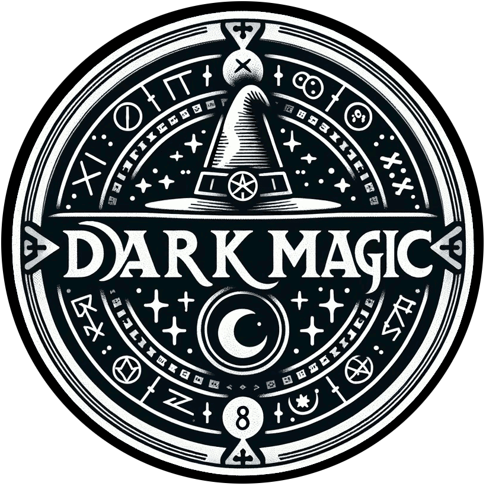

<h1 align="center">Dark Magic</h1>
<h3 align="center">An Open-Source Diablo 2 Engine Rewrite</h3>
<div align="center">
  
</div>

The maintenance policy for the standalone OpenDiablo2-derived format
libraries is documented in [CODECS.md](CODECS.md).

### About

Dark Magic is a community-driven open-source project that aims to recreate the 
legendary Diablo 2 gaming experience from scratch. Our mission is to modernize 
and enhance the game engine while preserving the classic gameplay mechanics and 
nostalgia that made Diablo 2 a timeless masterpiece.

Inspired by the passion of the Diablo community, we strive to deliver an 
authentic and faithful journey into the dark and dangerous world of Sanctuary. 
Together, we can bring back the magic of this iconic game and shape its future.

## Directory Structure
* `cmd` - contains only product binaries. The product targets are the Dark Magic
  client and realm.
* `internal/dev/tools` - repository-private asset inspection, extraction, catalog,
  and packaging utilities.
* `internal/dev/testapps` - repository-private interactive and headless manual test
  harnesses; these are not shipped as Dark Magic products.
* `pkg/models` - contains all the d2 models, much of them being the structs which represent records loaded from the MPQ excel files.
* `internal` - application host, layered content, native adapters, runtime capabilities, navigation, and engine-owned implementations.

## Architecture

The executable uses an explicit internal application host for native lifecycle,
a dynamic manager for native and Lua-defined components, a layered content VFS,
and versioned Lua capabilities. The Raylib backend remains isolated beneath
`internal/raylib`; scripts author scenes and overlays through retained rendering,
input, audio, records, locale, save, simulation, and navigation capabilities.

### Product binaries

Dark Magic targets two primary executables under `cmd`:

* **Client** — runs presentation and input for offline single-player,
  self-hosted multiplayer, and realm-connected games. Offline play may host the
  same authoritative simulation in-process, but client code must not become the
  authority for a remote realm character.
* **Realm** — provides the Battle.net-like control plane: authentication,
  accounts, trusted character persistence, game creation and discovery, and
  assignment to authoritative game sessions. It publishes the exact mod
  manifest required by a game and serves or identifies the corresponding
  redistributable payloads. User-supplied Diablo II data is never distributed.

The deterministic game-session server is shared infrastructure. It can run
in-process for offline play, as a client-created listen server, as a standalone
self-hosted server, or under realm orchestration. These modes must share
simulation commands, snapshots, validation, and persistence contracts rather
than grow separate gameplay implementations.

The client also includes an in-game Lua console. It targets an explicitly
selected Lua runtime rather than a process-global VM. Console evaluation is
serialized through that runtime's owner, uses a dedicated disposable resource
scope, and sees only the capabilities permitted for that runtime. Offline and
development sessions may enable mutation/debug capabilities; realm-connected
clients cannot use the console to bypass authoritative simulation or obtain
server-only capabilities.

# Join the Quest
Are you ready to embark on a journey into the heart of darkness? Unite with 
fellow adventurers and follow the development of Dark Magic on our and 
[community Discord server](https://discord.gg/gT9vTKfV8G).

Gather your courage, for a new era of sanctuary awaits. 
Embrace the magic, rewrite the destiny - with Dark Magic.


## Roadmap

The current package ownership rules, dependency direction, and target layout
are documented in [docs/ARCHITECTURE.md](docs/ARCHITECTURE.md).
The following services need to be implemented:
* `Character Generator` - uses the record manager to create character instances
* `Item Generator` - generates items using the record manager
* `Loot Generator` - uses the record manager to roll loot (generates items)
* `Map Generator` - uses the record manager and asset loaders to generate maps
* `Monster Generator` - uses the record manager to create instances of monsters
* `Renderer` - a wrapper around the rendering backend
* TBD

## How to Contribute
We welcome contributions from developers, artists, designers, and Diablo 
enthusiasts of all levels of expertise. If you want to be part of this journey, 
check out our [CONTRIBUTING.md](https://github.com/gravestench/dark-magic/blob/main/CONTRIBUTING.md) guide to get started.

Follow the lifecycle and dependency rules in
[the architecture guide](docs/ARCHITECTURE.md) when adding a long-lived engine
component.

## Development

Run the complete test suite with:

```shell
make test
make test-race
```

Client logging defaults to `info`. Select `debug`, `info`, `warn`, or `error`
with either the command-line flag or its environment equivalent:

```shell
go run -tags ffmpeg ./cmd/darkmagic --log-level debug
DARK_MAGIC_LOG_LEVEL=warn go run -tags ffmpeg ./cmd/darkmagic
```

Capture CPU activity for the full client run and a live-heap snapshot at clean
shutdown with:

```shell
MPQ_DIRECTORY=/path/to/diablo-ii \
  go run -tags ffmpeg ./cmd/darkmagic --profile-dir ./profiles/menu-review
```

Exit the client normally after exercising the behavior of interest. The output
directory contains `cpu.pprof`, `heap.pprof`, `cpu.pdf`, and `heap.pdf`. Raw
profiles can also be opened interactively with `go tool pprof`. PDF generation
requires Graphviz (`dot`) on `PATH`; if it is unavailable, Dark Magic preserves
the raw profiles and reports the rendering error. `DARK_MAGIC_PROFILE_DIR`
provides the same opt-in configuration for launchers that cannot pass flags.
Profile output under `profiles/` is intentionally ignored by Git.

Add `--profile-scenes title,main_menu,character_create` (or
`DARK_MAGIC_PROFILE_SCENES`) to generate filtered CPU reports and retained-heap
snapshots for individual scenes. Use `all` to capture every visited scene:

```shell
go run -tags ffmpeg ./cmd/darkmagic \
  --profile-dir ./profiles/frontend-review \
  --profile-scenes all
```

Scene artifacts are written beneath `scenes/<scene-id>/`. `cpu.pdf` combines
all visits to that scene using pprof labels. Each visit gets a numbered
`heap-NNN.pprof` and `heap-NNN.pdf` snapshot taken immediately before the
scene's owned resources are released.

Every scene snapshot also receives `diagnostics-NNN.json`, containing decoded
cache residency and hit/miss/eviction counts, cumulative decode time, retained
render resources and estimated RGBA bytes, and texture upload volume. A
repeatable frontend acceptance run is available with:

```shell
MPQ_DIRECTORY=/path/to/diablo-ii make profile
make profile-check
```

`profile-check` requires every scene listed in `docs/profile-budgets.json` to
have been visited and rejects snapshots exceeding the tracked budgets. Override
`PROFILE_DIR` or `PROFILE_BUDGETS` to compare another run or budget set.

Capture locally reviewable scene screenshots after ten stable presented frames:

```shell
MPQ_DIRECTORY=/path/to/diablo-ii make capture
```

The default captures `loading` and `title`; override `CAPTURE_SCENES` with a
comma-separated list or pass `--capture-scenes` directly. `--capture-settle-frames`
controls stabilization. Use `START_SCENE=character_create make capture` or
`--start-scene character_create` to enter a registered scene directly for local
development review. Capture exits automatically once every requested scene has
been recorded. The capture directory contains numbered PNGs plus a
`report.json` recording scene names, dimensions, and SHA-256 hashes. Capture
output under `captures/` is ignored by Git so Blizzard imagery remains local.
Saved-character presentation can be reviewed without modifying a real save
directory by combining `START_SCENE=character_select`,
`CAPTURE_SCENES=character_select`, and `FIXTURE_CHARACTERS=10`. The equivalent
development-only CLI option is `--fixture-characters 10`; its deterministic
in-memory records exercise both columns, paging, and expansion/hardcore labels.
When starting directly in `game_world`, `inventory`, or `character`, the first fixture is
selected automatically so asset-backed presentation can be captured in
isolation.
Character sources may also attach an immutable appearance snapshot containing
the resolved COF, palette, direction, and component DCC paths. Character
selection renders that equipment-aware composite when available and falls back
to the class presentation for legacy metadata-only records.

Inspect a legally obtained Diablo II asset without starting the renderer:

```shell
go run ./internal/dev/tools/asset_inspect \
  -source /path/to/d2data.mpq \
  -asset data/global/ui/Loading/loadingscreen.dc6 \
  -preview ./loading.png
```

Verify the curated screen-asset knowledge against a complete MPQ directory and
generate a JSON report plus palette-applied DC6 contact sheets:

```shell
go run ./internal/dev/tools/asset_catalog \
  -mpq-dir /path/to/diablo-ii \
  -out ./asset-catalog
```

Validate the installation against the redistributable structural fixture
without extracting or committing any Blizzard-owned pixels:

```shell
go run ./internal/dev/tools/asset_catalog \
  -mpq-dir /path/to/diablo-ii \
  -no-sheets \
  -fixture internal/content/shim/manifests/asset-fixture.v1.json
```

View a Bink cinematic directly from an MPQ directory (FFmpeg/`ffplay` is
required, and the temporary extracted file is removed when playback exits):

```sh
go run ./internal/dev/tools/bik_view \
  -source ~/d2_english_mpq \
  -asset data/local/video/New_Bliz640x480.bik
```

Standalone files are supported with `-file movie.bik`. The equivalent Make
target accepts `MPQ_DIRECTORY` and `BIK_ASSET` environment variables.

Build the client with `-tags ffmpeg` and link FFmpeg development libraries via
`pkg-config` to decode Bink video and audio in-process inside the Dark Magic
window:

```sh
MPQ_DIRECTORY=/path/to/diablo-ii go run -tags ffmpeg ./cmd/darkmagic
```

Portable builds retain `ffplay` as a separate-window diagnostic fallback. If it
is absent, startup follows the manifest's failure policy and skips video without
preventing the client from loading.

The report records missing and disputed paths, the archive layer that supplied
each asset, hashes, direction/frame counts, dimensions, and stored offsets. Use
`-manifest custom.json` to verify additional hypotheses or `-no-sheets` for a
metadata-only pass. The command is read-only with respect to the MPQs.

The optional community discovery index can be audited independently:

```shell
go run ./internal/dev/tools/asset_catalog \
  -mpq-dir /path/to/diablo-ii \
  -listfile ./docs/Diablo2UberListfile.txt \
  -no-sheets \
  -out ./asset-catalog
```

Its `listfile-report.json` deliberately distinguishes paths merely listed by
community research from paths actually resolvable in the selected MPQ set.

Host filesystem paths accepted by Dark Magic consistently expand `~`, `~/`,
`~\`, `$NAME`, `${NAME}`, and `%NAME%` forms on every supported platform.
This applies to environment configuration and command input/output paths. MPQ
asset paths are virtual paths and are intentionally not expanded.

When the debug web server is running, the same metadata and selected DC6/DCC
frames are available through the asset routes:

```text
GET /asset/inspect/data/global/ui/Loading/loadingscreen.dc6
GET /asset/preview/data/global/ui/Loading/loadingscreen.dc6?direction=0&frame=0
```

Run the standalone interactive scene slice:

```shell
go run ./internal/dev/testapps/scene_demo
```

The main engine also starts the integrated scene service. Set `MPQ_DIRECTORY`
to the directory containing `d2data.mpq` to render its configured DS1/DT1 map;
without it, the service uses a diagnostic grid:

```shell
MPQ_DIRECTORY=/path/to/mpqs go run ./cmd/darkmagic
```

To explore a real DS1 layout from an MPQ:

```shell
go run ./internal/dev/testapps/scene_demo \
  -source /path/to/d2data.mpq \
  -map data/global/tiles/Act1/BARRACKS/barE.ds1 \
  -dt1 data/global/tiles/Act1/BARRACKS/floor.dt1,data/global/tiles/Act1/BARRACKS/basewall.dt1,data/global/tiles/Act1/BARRACKS/barset.dt1 \
  -palette data/global/palette/ACT1/pal.pl2
```

Use WASD or the arrow keys to move, F5 to save, and F9 to load. See
[ROADMAP.md](ROADMAP.md) for restart progress and the next integration work.

## License

This project is licensed under the MIT License - see the 
[LICENSE](LICENSE) file for details.

## Acknowledgments
* [Open Diablo 2](https://github.com/opendiablo2/opendiablo2)
* [Gin](https://github.com/gin-gonic/gin)
* [Gopher LUA](https://github.com/yuin/gopher-lua)

---
*Dark Magic is not affiliated with or endorsed by Blizzard Entertainment, Inc. Diablo is a registered trademark of Blizzard Entertainment, Inc. All in-game content, imagery, and lore are the property of Blizzard Entertainment, Inc.*
