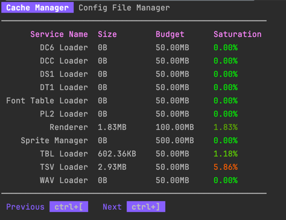

# Cache Manager
The purpose of this [servicemesh](https://github.com/gravestench/servicemesh) service is to provide a generic caching
implementation, and an integration interface for cache initialization.


## Dependencies
There are no servicemesh dependencies on other services.


## Integration with other services
This service integrates with the following services:
* [lua](../lua)
* [modal TUI](../modalTui)
* [web router](../webRouter)

_______
This service exports an integration interface `IsCacheManager` with an alias 
`Dependencncy` which are intended to be used by other services for dependency
resolution (see servicemesh.HasDependencies), and expose just the methods which 
other services should use.
```golang
type Dependency = Foo

type IsCacheManager interface {
    FlushAllCaches()
}
```

Other service can implement the following integration interface
to automatically have their cache flushed (which passes a new cache)
using their specific cache budget (which is given in bytes):
```golang
type HasCache interface {
    CacheBudget() int
    FlushCache(newCache *cache.Cache)
}
```

## Lua service integration
Nothing is implemented for the lua integration at the time of writing.

## Modal TUI service integration
This service integrates with the modal TUI service to provide a dashboard
for viewing the current state of all caches being managed.



## Web router service integration

If the [web router service](../webRouter) is present at servicemesh, this service will
register routes for retrieving data.

The route slug for this service is `cache`, so all routes defined will be under
that route group.

| route                             | method | purpose                                               |
|-----------------------------------|--------|-------------------------------------------------------|
| `cache/stats`                     | GET    | yields the stats for all caches being manages as json |
| `cache/flush`                     | GET    | flushes all caches being managed                      |